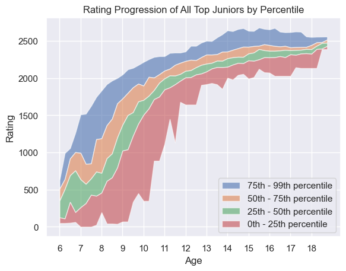
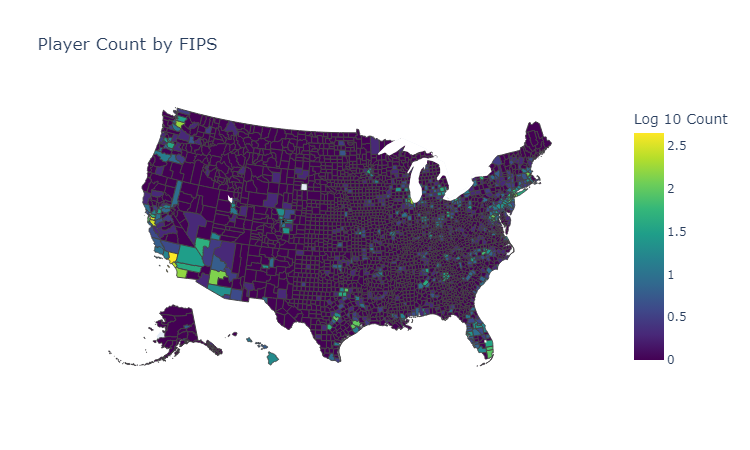
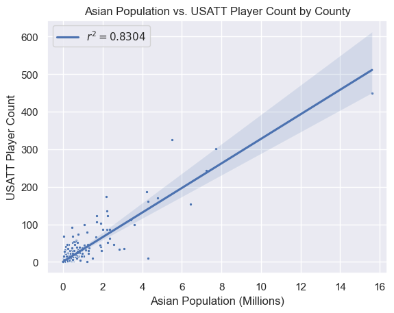

# USATT Player Development Analysis

An exploratory data-science project studying how USA Table Tennis (USATT) players develop over time, where organized participation is concentrated, and which early signals are associated with high-level junior performance.

## Project Motivation

Table-tennis ratings provide a longitudinal record of player development, but a current rating does not explain how quickly a player reached it, whether improvement has stalled, or how much local access may shape the observed player population. I built this project to connect those questions rather than treating rating history as an isolated prediction problem.

The analysis asks:

- How does rating change with age, tournament experience, and time played?
- When do players begin to plateau, and does that differ between juniors and adults?
- Can the shape of an early rating trajectory help identify juniors likely to reach an elite rating threshold?
- Where are USATT players concentrated geographically, and what population characteristics are associated with that participation?

The repository is designed as an inspectable analysis portfolio. The notebooks expose the data cleaning, feature engineering, statistical comparisons, and visual reasoning behind the results.

## Approach

### Longitudinal player data

The project combines USATT player profiles, tournament history, ratings, and tournament metadata. The data pipeline parses inconsistent date formats, joins player and history tables, removes records missing analysis-critical fields, and derives:

- age at each tournament;
- days since a player's first recorded tournament;
- initial and final tournament ratings;
- time required to reach rating milestones;
- junior and adult population labels.

The cleaned data is reused by the notebooks and saved under `analysis/top_juniors/` for the classification and progression analyses.

### Junior outcome definition

For the junior analysis, a **top junior** is a player who reaches a target rating before age 19. The primary definition uses thresholds of 2,400 for male players and 2,200 for female players. Alternative thresholds are evaluated to see whether conclusions depend heavily on the chosen definition.

### Rating progression model

Player histories are modeled with a logarithmic progression curve:

$$
R(t) = a\log(1 + bt)
$$

where $t$ is days of participation and $a$ is used as a compact measure of progression rate. The project compares this coefficient between top juniors and other players using full histories, the first $n$ tournaments, and age-limited histories. Fitted distributions are combined into a probability curve that estimates how closely a player's early trajectory resembles the top-junior group.

### Development and plateau analysis

The progression notebooks measure time between rating milestones, construct rolling averages, and compare improvement across player groups. A player is classified as plateaued when their recent one-year history contains no gain greater than 50 rating points. This allows junior and adult plateau rates to be compared while keeping the definition explicit and reproducible.

### Geographic and demographic context

The heatmap analysis tests whether national summaries hide meaningful geographic concentration. Player ZIP codes are normalized, converted to five-digit FIPS county identifiers through a ZIP crosswalk, and deduplicated by USATT player number. County-level player counts are then joined to county GeoJSON boundaries for mapping. The count map uses $\log_{10}(count + 1)$ so a few very large counties do not dominate the color scale.

To add demographic context, county-level US Census estimates are aggregated across the available age and sex categories and joined to the FIPS-level USATT counts. The analysis compares log-transformed Asian population with log-transformed USATT player count and calculates Pearson correlations after filtering out counties with very small observed player counts. This is a descriptive association analysis, not a causal demographic model.

## Results

The results are exploratory rather than a production prediction system, but they show several useful patterns.

### Early progression is associated with later junior performance

Top-junior players reached 2,200 approximately 372 to 624 days faster than comparison players in the executed progression analysis, depending on the rating thresholds used to define the top-junior group. This result measures time between rating milestones, so it captures pace of improvement as well as eventual performance.



The figure above summarizes the rating paths of classified top juniors. For each age from 6 through 19, the notebook finds each player's first rating observation in a quarter-year age window and calculates the 0th, 25th, 50th, 75th, and 99th percentiles. The widening bands show that there is no single development path, which supports comparing distributions rather than relying only on an average trajectory.

The logarithmic model provides a useful first approximation of this behavior: gains tend to be larger earlier in a player's recorded development and flatten as experience accumulates. The coefficient distributions provide a compact way to compare those progression shapes.

### Participation is geographically concentrated



This county-level choropleth shows where the players in the USATT dataset are located. The method normalizes ZIP and ZIP+4 values, joins them to a ZIP-to-FIPS crosswalk, removes duplicate player IDs, and groups the remaining players by county. The logarithmic color scale makes both high-count metropolitan counties and lower-count regions visible.

The concentration matters for interpretation: coaching ecosystems, club availability, tournament access, and urban density may influence both who appears in the dataset and how often those players compete. Geographic summaries therefore provide context for the longitudinal development results rather than serving only as decoration.

### Asian population is associated with USATT participation



This scatterplot compares county-level Asian population with USATT player count after log transformations. The underlying data combines Census demographic estimates with the FIPS-level player counts used in the map above. Pearson correlation is calculated on the filtered, transformed values to reduce the effect of zero-heavy observations.

The relationship is descriptive and should not be interpreted as causal. It may reflect club availability, urban density, immigration patterns, household participation, or other unmeasured factors. Including the analysis demonstrates how domain data can be combined with external demographic and geographic data while keeping the limits of the inference explicit.

### Plateaus and population-level trends

The plateau notebook compares junior and adult plateau classifications, while the average-player and simulation notebooks use rolling averages and synthetic progression to explore typical trajectories. Together, these analyses reinforce that rating history reflects a mixture of age, participation frequency, competitive environment, and individual development rather than one universal curve.

The results should therefore be read as evidence of association, not proof that the model can determine a player's future.

## Repository Layout

```text
data/                       Source and cleaned USATT tables
scraper/                    Scraping and field-generation experiments
analysis/load_data/         Shared data-loading utilities
analysis/progression_analysis/
                            Improvement, plateau, and simulation notebooks
analysis/top_juniors/       Cleaning, classification, and regression analysis
analysis/average_player/    Population-level progression analysis
analysis/heatmap/           Geographic analysis and supporting datasets
```

## Tools and Techniques

- Python, Jupyter, pandas, and NumPy
- SciPy linear regression and nonlinear curve fitting
- scikit-learn metrics and regression utilities
- Matplotlib, seaborn, and Plotly visualizations
- Longitudinal data cleaning and feature engineering
- GeoJSON, ZIP-to-FIPS joins, and Census demographic data
- Exploratory modeling, distribution comparison, and correlation analysis

## Running the Analysis

The notebooks are the primary entry points. Open the relevant notebook in Jupyter or VS Code and run its cells in order. The top-junior workflow is:

1. Run `analysis/top_juniors/clean.py` to create the filtered player and history training sets.
2. Open `analysis/top_juniors/log_reg.ipynb` to inspect progression coefficients and top-junior probability estimates.
3. Use `analysis/top_juniors/log_reg_by_age.py` and `n_tournaments_log_reg.py` for age-limited and early-tournament validation analyses.
4. Open `analysis/heatmap/heatmap.ipynb` to reproduce the county maps and demographic comparisons.

The current data loader contains absolute paths inherited from the original local development environment. To reproduce the notebooks on another machine, update the paths in `analysis/load_data/load.py` to point to this repository's `data/` directory before running the analyses.

## Limitations and Next Steps

- Replace machine-specific paths with repository-relative paths and add an environment file for reproducibility.
- Add formal train/test splits and cross-validation for the early-progression classifier.
- Report confidence intervals and calibration, not only accuracy, precision, and recall.
- Account for tournament frequency, inactivity, and changes in the USATT rating system.
- Treat ZIP-derived location as approximate and investigate missing or outdated addresses.
- Test whether a survival model or mixed-effects model better represents milestone timing and player-to-player variation.
- Add club-level and tournament-level features to separate access from player ability.

This project is a work in progress intended to make the full analytical process inspectable: from messy longitudinal data to definitions, models, visual evidence, and questions for further study.
